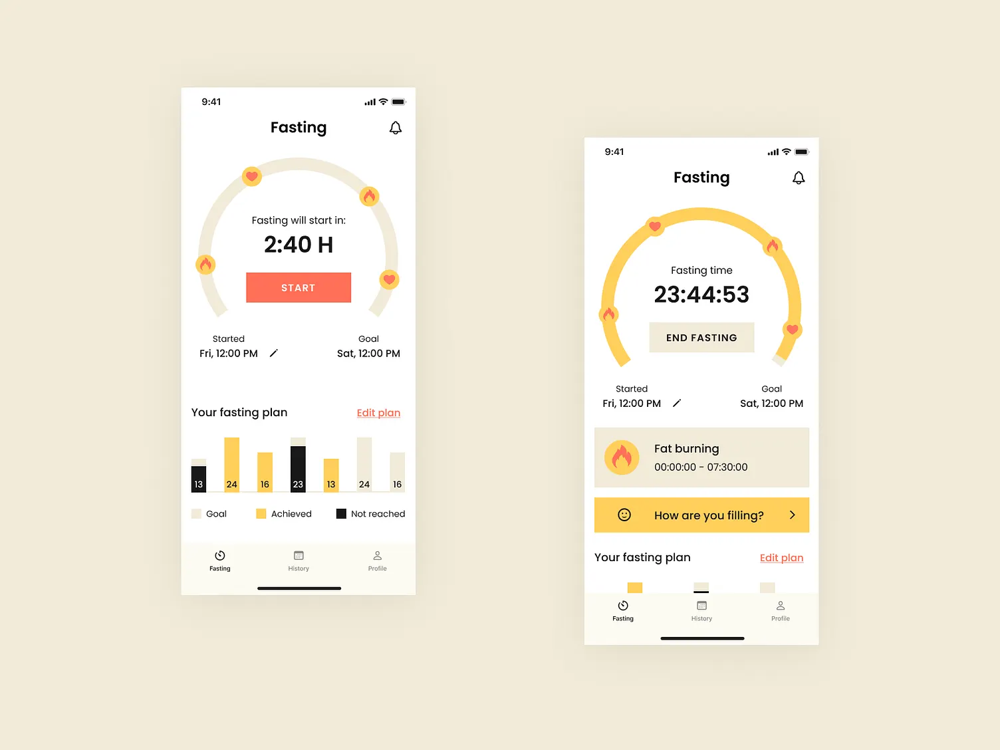

# 🕐 FastingApp - Intermittent Fasting Tracker

A comprehensive React Native mobile application for tracking intermittent fasting sessions, monitoring weight progress, and managing your health journey. Built with Expo and TypeScript.



## ✨ Features

### 🎯 Fasting Timer
- **Customizable Durations**: Choose from preset options (12, 14, 16, 18, 20, 22, 24 hours) or set custom durations up to 30 days
- **Real-time Progress Tracking**: Beautiful circular progress indicator with live countdown
- **Visual Animations**: Smooth animations and transitions for an engaging user experience
- **Session Management**: Start, pause, and end fasting sessions with confirmation dialogs
- **Persistent State**: Fasting sessions are saved and restored across app restarts

### 📊 Weight Tracking
- **Weight Logging**: Easy weight entry with date/time tracking
- **Visual Charts**: Interactive charts showing weight progress over time
- **Unit Support**: Toggle between kg and lbs
- **Progress Monitoring**: Track your journey towards target weight goals
- **Complete History**: View all weight entries with timestamps

### 👤 Profile Management
- **User Profiles**: Personalized profiles with name and target weight
- **Editable Information**: Update your profile details anytime
- **Statistics Dashboard**: View current weight, target weight, and progress
- **Data Persistence**: All profile data saved locally using AsyncStorage

### 📈 History & Analytics
- **Fasting History**: Complete log of all fasting sessions
- **Session Details**: View start time, end time, duration, and completion status
- **Weight History**: Track weight changes over time
- **Delete Functionality**: Remove unwanted entries with confirmation

### 🎨 User Experience
- **Dark Mode Support**: Automatic theme switching based on system preferences
- **Smooth Animations**: Polished UI with React Native Reanimated
- **Haptic Feedback**: Tactile responses for better interaction
- **Intuitive Navigation**: Bottom tab navigation for easy access to all features
- **Responsive Design**: Optimized for various screen sizes

## 🚀 Getting Started

### Prerequisites
- Node.js (v14 or higher)
- npm or yarn
- Expo CLI
- iOS Simulator (for iOS development) or Android Emulator (for Android development)

### Installation

1. **Clone the repository**
   ```bash
   git clone <repository-url>
   cd FastingApp
   ```

2. **Install dependencies**
   ```bash
   npm install
   ```

3. **Start the development server**
   ```bash
   npx expo start
   ```

4. **Run on your device**
   - Scan the QR code with Expo Go app (iOS/Android)
   - Press `i` for iOS Simulator
   - Press `a` for Android Emulator
   - Press `w` for web browser

### Building for Production

**Android APK**
```bash
npx expo build:android
```

**iOS**
```bash
npx expo build:ios
```

## 📱 App Structure

```
FastingApp/
├── app/                    # Main application screens
│   ├── (tabs)/            # Tab-based navigation
│   │   ├── index.tsx      # Fasting timer screen
│   │   ├── history.tsx    # Fasting history screen
│   │   └── profile.tsx    # Profile & weight tracking
│   └── _layout.tsx        # Root layout configuration
├── components/            # Reusable components
│   ├── fasting/          # Fasting-specific components
│   └── ui/               # UI components
├── contexts/             # React Context providers
│   └── ThemeContext.tsx  # Theme management
├── hooks/                # Custom React hooks
│   ├── useFasting.ts     # Fasting logic
│   ├── useProfile.ts     # Profile management
│   └── useWeight.ts      # Weight tracking
├── constants/            # App constants and colors
└── assets/              # Images, fonts, and other assets
```

## 🛠️ Tech Stack

- **Framework**: [Expo](https://expo.dev) (~54.0.23)
- **Language**: TypeScript
- **UI Library**: React Native (0.81.5)
- **Navigation**: Expo Router (file-based routing)
- **State Management**: React Context API
- **Storage**: AsyncStorage
- **Charts**: react-native-chart-kit
- **Animations**: React Native Reanimated
- **Icons**: Expo Symbols & Vector Icons
- **Styling**: StyleSheet API with dynamic theming

## 📦 Key Dependencies

```json
{
  "expo": "~54.0.23",
  "react": "19.1.0",
  "react-native": "0.81.5",
  "expo-router": "~6.0.14",
  "@react-native-async-storage/async-storage": "^2.2.0",
  "react-native-chart-kit": "^6.12.0",
  "react-native-reanimated": "~4.1.1",
  "expo-linear-gradient": "^15.0.7",
  "expo-haptics": "~15.0.7"
}
```

## 🎯 Usage Guide

### Starting a Fast
1. Open the app and navigate to the **Fasting** tab
2. Tap **Change Duration** to select your fasting period
3. Choose from preset durations or enter a custom duration
4. Tap **START** to begin your fasting session
5. Monitor your progress with the circular timer

### Logging Weight
1. Navigate to the **Profile** tab
2. Tap the **+** button next to "Weight Tracking"
3. Enter your current weight
4. Tap **Save** to log the entry
5. View your progress in the weight chart

### Editing Profile
1. Go to the **Profile** tab
2. Tap the **Edit** button (pencil icon)
3. Update your name and target weight
4. Tap **Save** to apply changes

### Viewing History
1. Navigate to the **History** tab
2. View all completed fasting sessions
3. Tap any session to see detailed information
4. Swipe to delete unwanted entries

## 🎨 Customization

### Changing Theme Colors
Edit `constants/Colors.ts` to customize the color scheme:
```typescript
export const Colors = {
  light: {
    primary: '#FF6B35',
    background: '#ffffff',
    // ...
  },
  dark: {
    primary: '#FF6B35',
    background: '#000000',
    // ...
  }
}
```

### Modifying Fasting Durations
Edit the preset durations in `app/(tabs)/index.tsx`:
```typescript
const fastingDurations = [12, 14, 16, 18, 20, 22, 24];
```

## 🐛 Troubleshooting

**App won't start**
- Clear cache: `npx expo start -c`
- Reinstall dependencies: `rm -rf node_modules && npm install`

**AsyncStorage errors**
- Clear app data on your device/emulator
- Restart the development server

**Build errors**
- Ensure all dependencies are compatible
- Check Expo SDK version compatibility

## 📄 License

This project is private and not licensed for public use.

## 🤝 Contributing

This is a personal project. Contributions are not currently being accepted.

## 📧 Contact

For questions or support, please contact the developer.

---

**Built with ❤️ using Expo and React Native**
